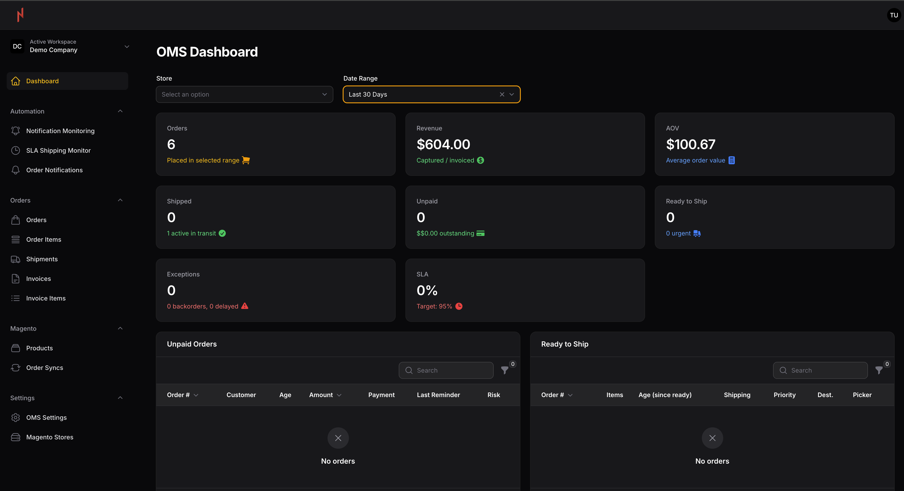

# FlowOMS Documentation

Complete documentation for FlowOMS - Multi-tenant Order Management System for Magento 2 stores.

## Table of Contents

### Getting Started
- [Installation Guide](../README.md#installation) - Setup instructions
- [Quick Start](../README.md#quick-start) - Get up and running quickly
- [Configuration](configuration.md) - Environment and system configuration

### Architecture & Concepts
- [System Architecture](architecture.md) - How FlowOMS is structured
- [Multi-Tenancy](features/multi-tenancy.md) - Tenant isolation and scoping
- [Database Schema](architecture.md#database-schema) - Tables and relationships

### Integrations
- [Magento 2 Integration](integrations/magento-integration.md) - Connect to Magento stores
- [API Authentication](integrations/api-authentication.md) - Sanctum token-based auth
- [Order Synchronization](integrations/magento-integration.md#order-sync) - Two-phase sync process

### Features
- [Dashboard Overview](features/dashboard.md) - Real-time KPI widgets
- [Order Management](features/order-management.md) - Order lifecycle and workflows
- [SLA Monitoring](features/sla-monitoring.md) - Service level tracking
- [Email Notifications](features/notifications.md) - Automated alerts

### REST API
- [API Overview](api/overview.md) - Authentication, rate limiting, pagination
- [Orders API](api/orders-api.md) - Order endpoints and filtering
- [Invoices API](api/invoices-api.md) - Invoice management
- [Shipments API](api/shipments-api.md) - Shipment tracking
- [Webhooks](api/webhooks.md) - Event-driven integrations

### Development
- [Local Setup](development/local-setup.md) - Development environment
- [Testing](development/testing.md) - Unit, feature, and E2E tests
- [Contributing](development/contributing.md) - Contribution guidelines

## Dashboard Preview

*FlowOMS Dashboard showing real-time KPIs, order widgets, and SLA monitoring*

## Quick Links

- **Main Repository**: [https://github.com/florinel-chis/flow-oms](https://github.com/florinel-chis/flow-oms)
- **Issues**: [GitHub Issues](https://github.com/florinel-chis/flow-oms/issues)
- **Laravel Docs**: [https://laravel.com/docs](https://laravel.com/docs)
- **Filament Docs**: [https://filamentphp.com/docs](https://filamentphp.com/docs)

## Need Help?

- Check the documentation sections above
- Review inline code comments
- Open an issue on GitHub
- Refer to Laravel and Filament documentation
